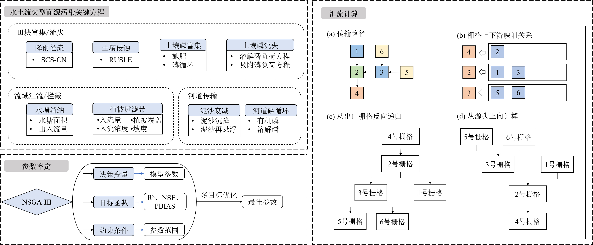

## 分布式流域模型桌面平台

针对现有半分布式模型的局限性，本项目构建了耦合田块尺度富集/流失、流域尺度传输及河道迁移过程的分布式水土流失型面源污染模型，开发了高效栅格汇流算法，破解了丘陵山区水土流失面源污染精准评估和防控的技术瓶颈问题。项目基于Vue3+Electron开发应用界面，基于Python开发模型运算核心模块（地理信息数据处理、NSGA-III智能率定）。

### 技术栈

Vue3 + Electron + ElementPlus + echarts + Python + 机器学习

##### 项目创建页面

· 点击新建项目，选择一个空文件夹作为项目文件夹。

· 屏幕右侧显示项目的基本信息及数据导入情况。

##### 选择模型模拟期

选择模型的模拟起始时间和结束时间。

##### 降雨数据导入

· 导入方式：可通过将txt文件拖入框内/导入数据按钮来导入降雨数据。

· 导入格式：降雨数据必须是txt格式，第一行为起始时间，之后每一行数据为每天的降雨数据（注：降雨数据的时间范围必须与选择的模拟期相匹配）。

· 随后electron主进程通过child_process模块运行python文件，计算月降雨量，将数据返回给渲染进程，通过echarts进行绘制月降雨量的分布折线图。

此处插图

##### 土地利用/土壤类型/DEM数据导入

· 导入方式：与降雨数据类似，可以通过拖拽与按钮进行导入。

· 导入格式：此类地理信息数据要求导入 tif 格式，导入后通过Python中的gdal库将 tif 格式的文件转为 csv 格式，统计数据分布情况，将数据返回给渲染进程，通过echarts进行绘制月降雨量的分布折线图。

·其中土壤类型数据与K值相关，其映射关系参考以下文献：

*吴昌广,曾毅,周志翔,王鹏程,肖文发,罗翀.三峡库区土壤可蚀性K值研究[J].中国水土保持科学,2010,8(03):8-12.DOI:10.16843/j.sswc.2010.03.002.*

##### 水土流失量运算模块

水土流失量运算使用RUSLE方程。 -> 页面开发中

##### 分布式模型开发模块

· 产汇流模块：

传统的栅格汇流算法是基于源头到出口的正向思路实现的[19]，但是正向计算的思路存在计算效率低下的问题，因此本研究提出了结合反向递归及哈希表的优化算法。具体步骤如下：

（1）基于D8算法获得栅格之间的上下游关系，构建一个字典保存栅格之间的上下游关系，字典的值保存了某一栅格所有上游栅格的集合，键则为下游栅格（图3b）。字典基于哈希算法实现，键名是唯一、不能重复的，因此只需要以接近常量的时间便可以查询某一栅格的所有上游栅格，无需遍历字典中的所有元素。因此在查询某一栅格的上游栅格时，查询时间并不会随着流域面积（字典长度）的增大而增大；

（2）基于递归算法，从流域出口反向索引栅格之间的上下游关系，对全流域栅格进行汇流计算。递归算法是在函数中直接或调用自身的算法。在汇流计算时，对流域出口栅格进行反向递归索引：首先在字典中查询该栅格，如果不存在字典中则该栅格不存在上游栅格，直接基于该栅格的源图层进行计算；如果该栅格存在于字典中，则说明该栅格存在上游栅格，则对其所有上游栅格再次进行反向递归索引，重复以上判断，待所有上游节点完成模拟并返回结果时，再基于上游栅格的模拟结果及该栅格的源图层进行模拟。以图3a所示的传输路径为例，其模拟步骤如下：

（1）从出口栅格4号栅格开始索引，在传输字典中索引到了它的上游栅格2号栅格，于是对2号栅格进行索引，待2号栅格的模拟结果返回后，再对4号栅格进行模拟；

（2）对2号栅格进行索引，在传输字典中索引到了它的上游栅格1号栅格和3号栅格，于是先对1号栅格和3号栅格进行模拟，待1号栅格和3号栅格的模拟结果返回后，再对2号栅格进行模拟；

（3） 对1号栅格进行索引，发现1号栅格无上游栅格，则直接进行该栅格的模拟，并将模拟结果返回给2号栅格；对3号栅格进行索引，索引到了它的上游栅格5号栅格和6号栅格，于是先对5号栅格和6号栅格进行模拟，基于5号栅格和6号栅格的入流情况对3号栅格进行模拟；

（4） 对5号栅格和6号栅格进行索引，发现二者无上游栅格，则直接进行模拟，并将模拟结果返回给3号栅格。

假设某流域一共有n个栅格，从流域出口反向递归索引保证一次模拟只需要进行n次计算，而正向计算需要不断地判断上下游关系，计算次数可能会达到n2次甚至n3次。经过递归算法和哈希表的优化，所构建分布式模型的运行时间只会随流域面积的增大及内部方程的增多线性增长而不是指数增长，为后续的高效计算和率定奠定了基础。

· 率定模块：
